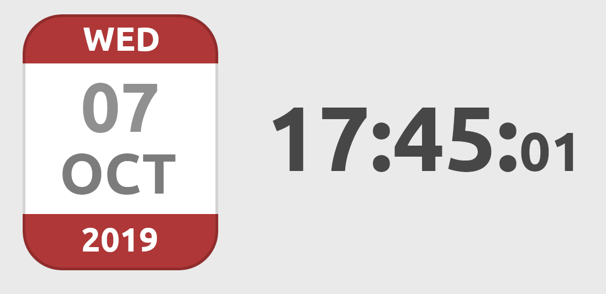

# Dates

# Exercise 1
Find the timezones of :

Anchorage (USA)
Reykjavik (Iceland)
Saint-Petersburg (Russia)
And display the date and time of these cities along with the time and date of Brussels.

# Exercise 2
Using timestamps, find how many days have passed since the date of your birth. Feeling old, yet?

Write a function to find how many days have passed since any point in time (after 1970).

# Exercise  3
Using timestamps, find the exact time and date we will be in 80000 hours.

Write a function to display the time and date for any amount of hours given in the future. Create a number input for the hours and listen for keyup events, dynamically display the date in the number of hours given by the input

# Exercise  4
Using HTML, CSS (and javascript, of course) reproduce the following picture. This should be centered both horizontaly and vertically in your page.

The date should be of today, in your timezone. Refresh the display every seconds (hint), so the time stays exact even when the page stays open for a long time

When clicking on the hours, toggle the display in 12-hours format or back to 24-hours format.